### Install Guide for CE OpenGL Study  
### Development Environments  
- OS : macOS Mojave 10.14.6     
- IDE : XCode 11.1  

  

 macOS 

 
  
## Setting  
### 0. Install Homebrew  
`$ /usr/bin/ruby -e "$(curl -fsSL https://raw.githubusercontent.com/Homebrew/install/master/install)"`
### 1. Install glfw, glew
`$ brew install glfw`    
`$ brew install glew`
### 2. XCode Project Setting
  - clone this repo, run XCode -> `File` -> `Open` -> Open `GL_Study.xcodeproj`  
     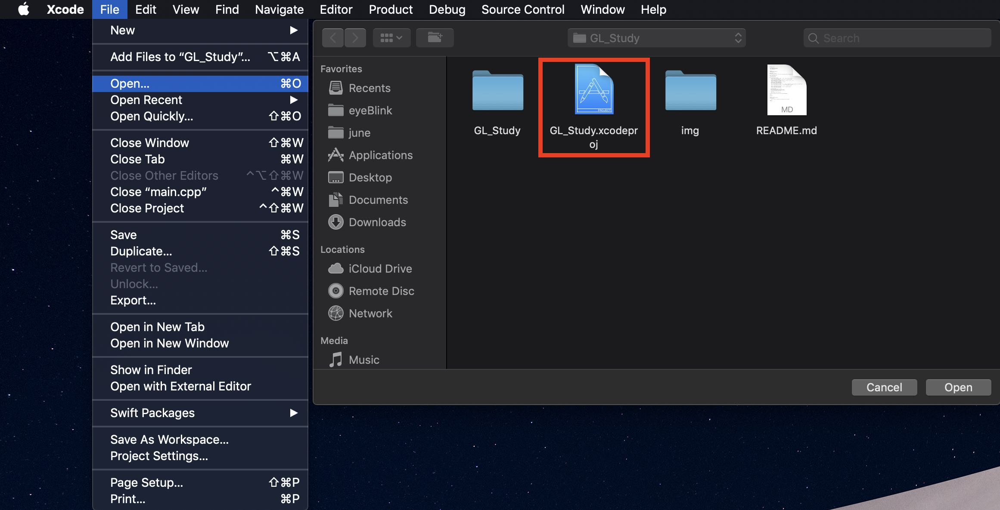  
  - Go `File` -> `Project Settings...` -> Build System : `Legacy Build System`  
     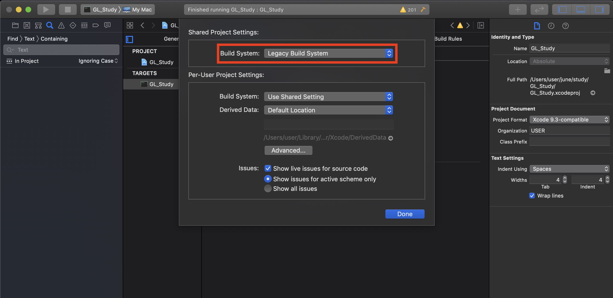  
  - `Signing & Capabilities` -> `Hardened Runtime`(if it exists) -> Click `x` icon  
     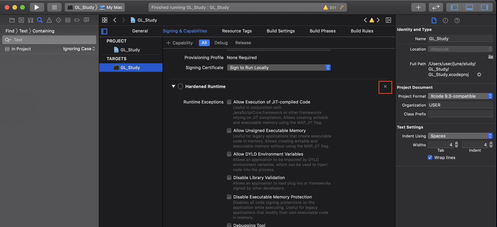  
  - `General` -> `Frameworks and Libraries` -> Click `+`  
     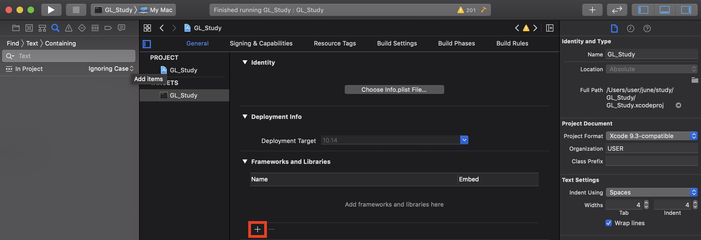  
  - Search `OpenGL`, add `OpenGL.framework'  
     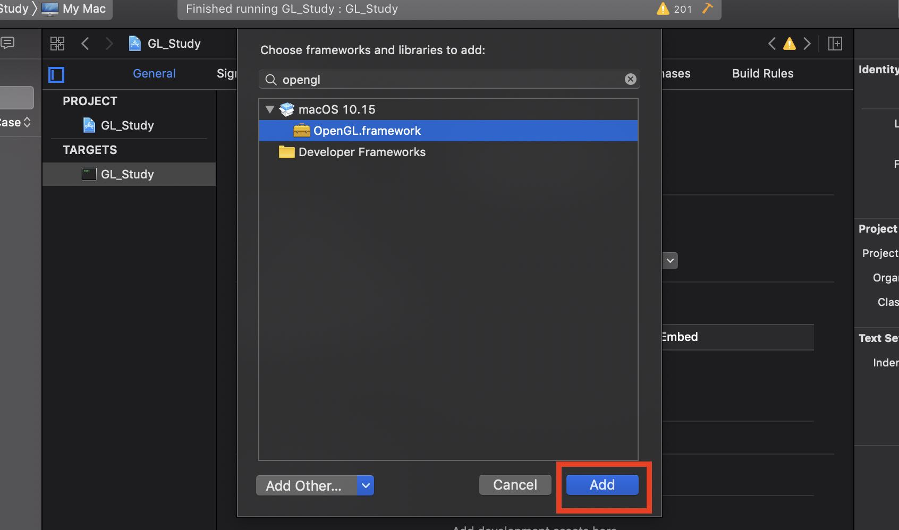  
  - Click `+` -> `Add Other..` -> `Add Files...` -> `Shift + Command + G` -> Go to the folder `/usr/local/Cellar/`  
     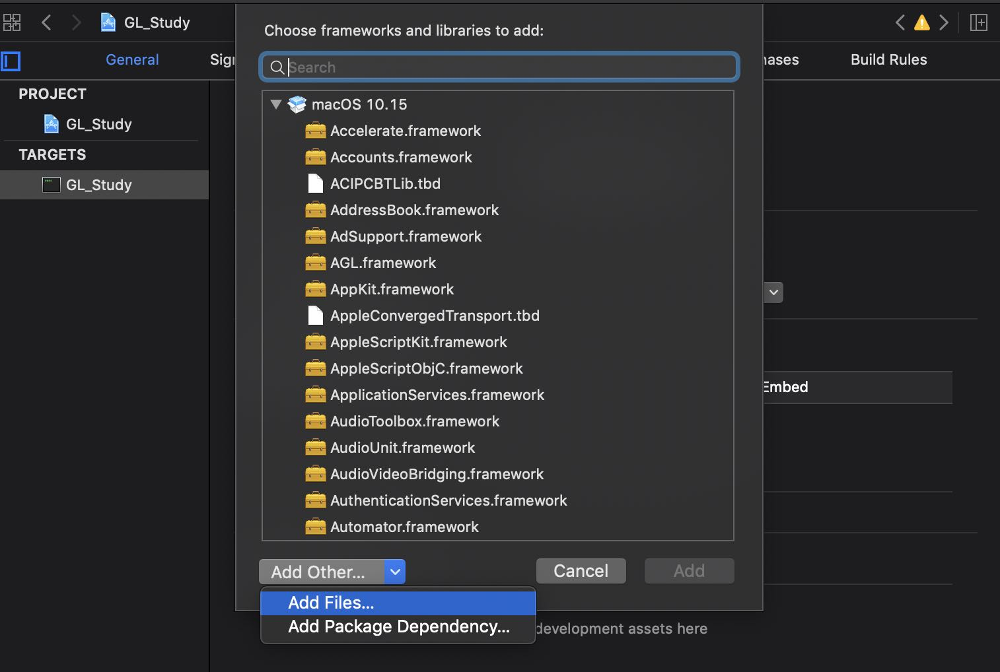       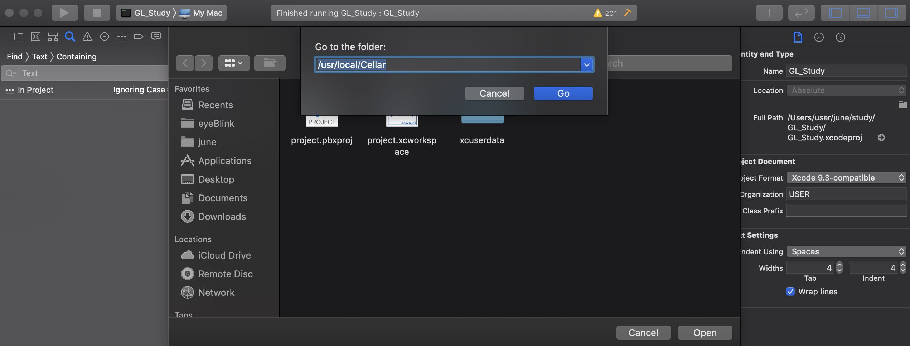  
     
  - `glew` -> `(Your Version, ex: 2.1.0_1)` -> `lib` -> `libGLEW.2.1.0.dylib` 
     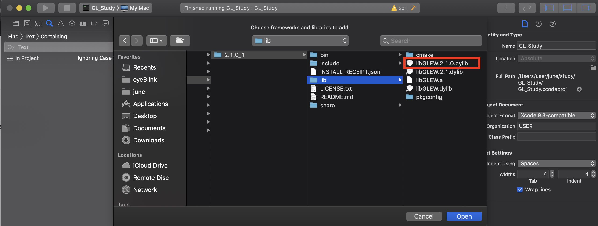  
  - `glfw` -> `(Your Version, ex: 3.3.2)` -> `lib` -> `libglfw.3.3.dylib` 
     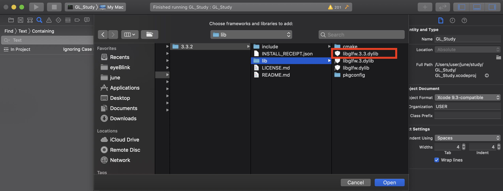  
  
  - Go `Build Settings`  
  - Search `Header Search Path`, add both   
  `/usr/local/Cellar/glfw/(Your ver)3.3.2/include/`  
  `/usr/local/Cellar/glew/(Your ver)2.1.0_1/include/`  
     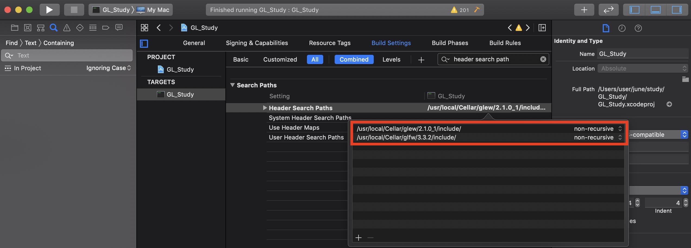  
  - Build & Run  
    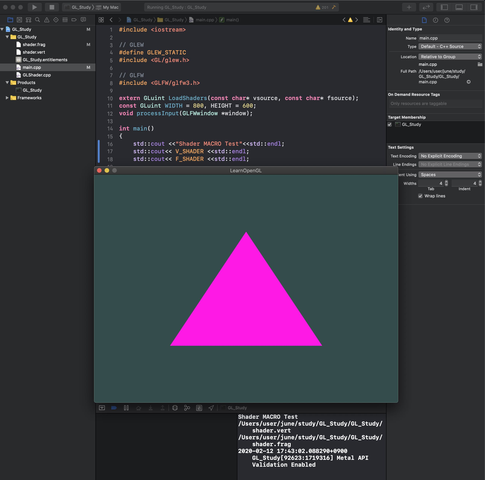  
    
### 3. Shader Macro  
  - `V_SHADER`와 `F_SHADER` 라는 macro를 통해 shader 파일들을 실행파일이 읽어 올 수 있습니다.  
  - `V_SHADER`와 `F_SHADER` 라는 macro를 통해 shader 파일들을 실행파일이 읽어 올 수 있습니다. 따라서 매 실행시마다 실행파일 경로 찾아서 복사해야하는 번거로움이 없어졌습니다.  
  - 만약 안된다면, `Build Settings` -> `preprocessor macros` 검색 -> `Debug`에다가
  `F_SHADER=\"${PROJECT_DIR}/GL_Study/shader.frag\"`  
  `V_SHADER=\"${PROJECT_DIR}/GL_Study/shader.vert\"` 을 추가해줍니다.(스샷 참고)
  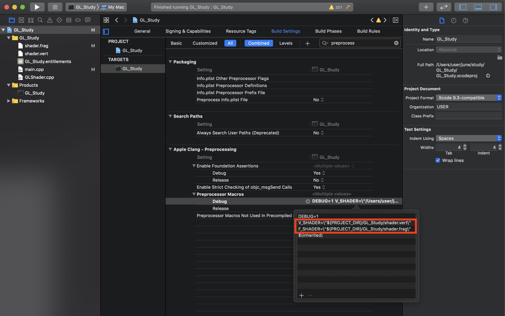  
    - 위와같이 매크로가 설정돼있기 때문에 shader파일명을 변경하거나, 매크로 변수명을 변경하면 그에따라 환경설정을 다시 해줘야 합니다.
    
  [**Reference**](https://blog.naver.com/ross1573/221460518505)  
  

  
  
  
  
  
  
 Windows 

  
  
  
  - [OpenGL Setting for Windows](https://webnautes.tistory.com/1102)
  
  

  
  
