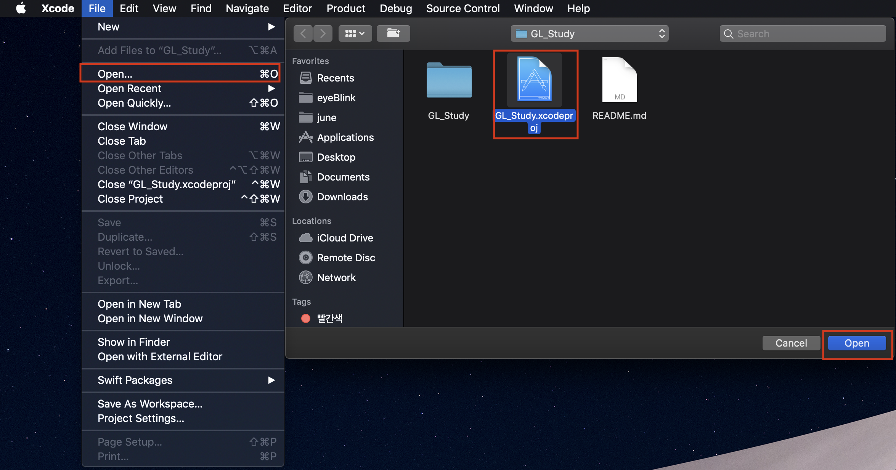
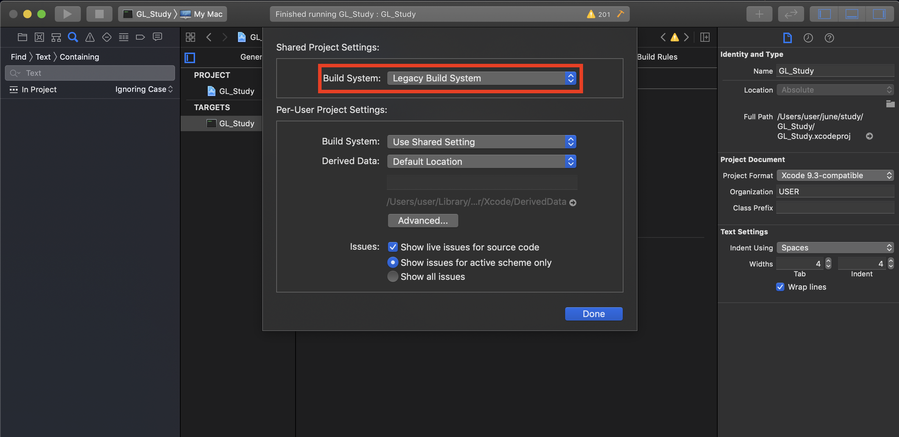
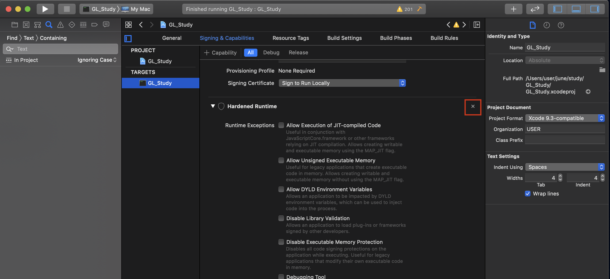
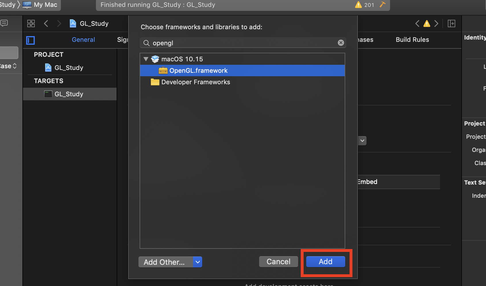
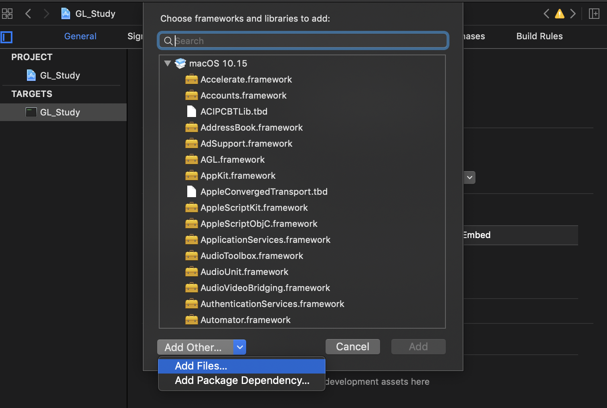
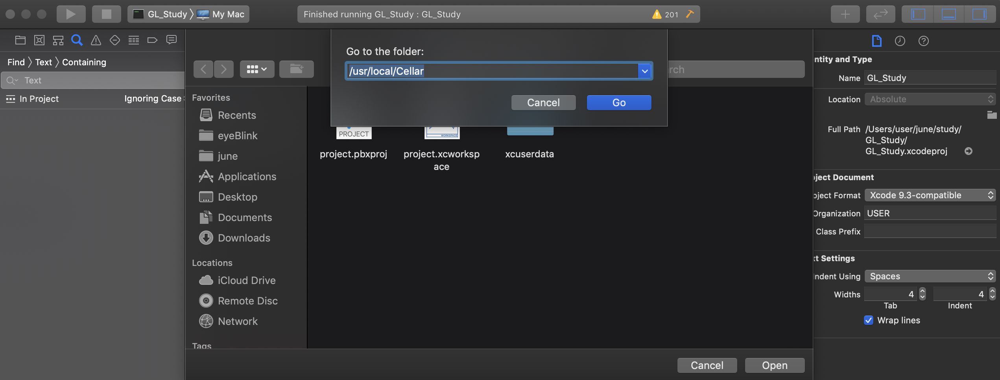
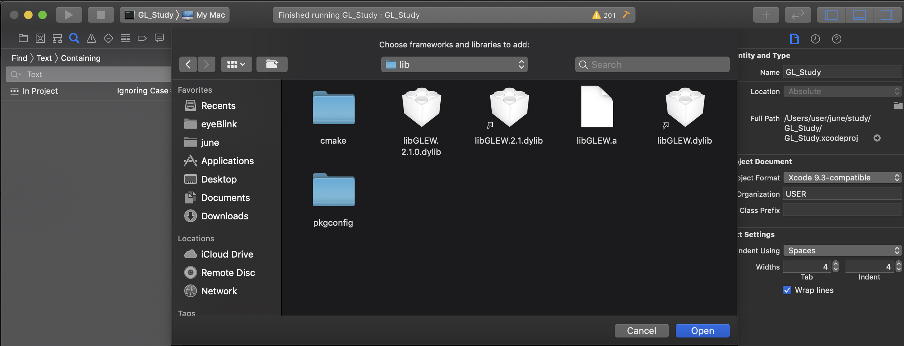
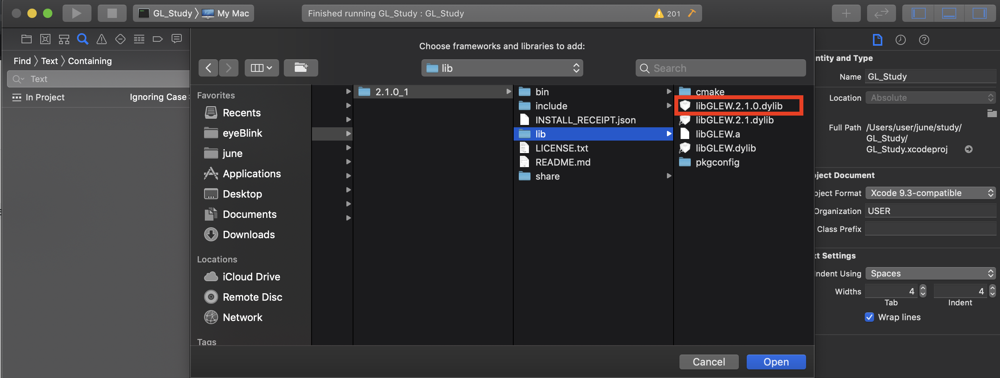
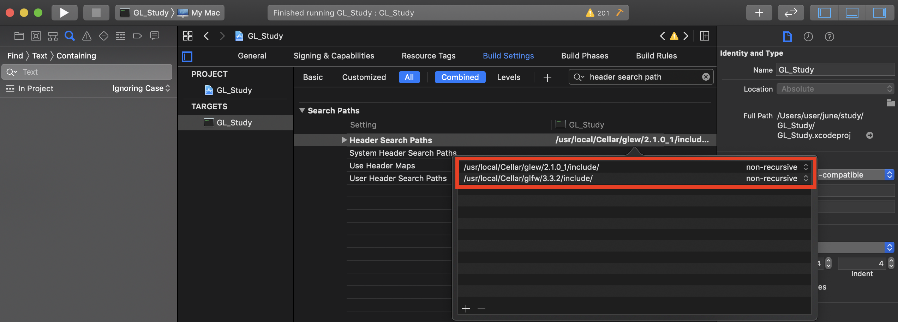
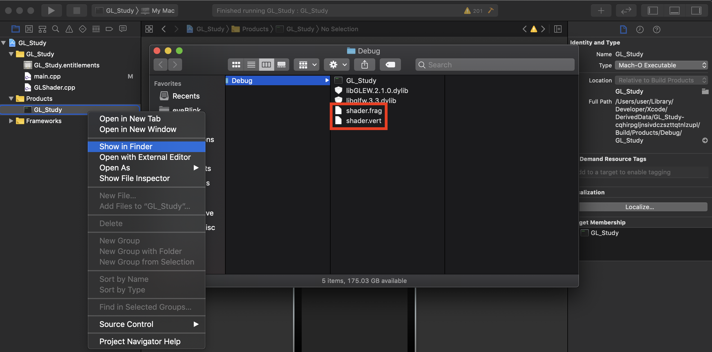

### OpenGL Study  

## Development Environments  
- OS : macOS Mojave 10.14.6     
- IDE : XCode 11.1  

  

 macOS 

 
  
## Setting  
### 0. Install Homebrew  
`$ /usr/bin/ruby -e "$(curl -fsSL https://raw.githubusercontent.com/Homebrew/install/master/install)"`

### 1. Install glfw, glew
`$ brew install glfw`    
`$ brew install glew`

### 2. XCode Project Setting
  - clone this repo, run XCode -> `File` -> `Open` -> Open `GL_Study.xcodeproj`  
       
  - Go `File` -> `Project Settings...` -> Build System : `Legacy Build System`  
       
  - `Signing & Capabilities` -> `Hardened Runtime`(if it exists) -> Click `x` icon  
       
  - `General` -> `Frameworks and Libraries` -> Click `+`  
       
  - Search `OpenGL`, add `OpenGL.framework'  
       
  - Click `+` -> `Add Other..` -> `Add Files...` -> `Shift + Command + G` -> Go to the folder `/usr/local/Cellar/`  
              
     
  - `glew` -> `(Your Version, ex: 2.1.0_1)` -> `lib` -> `libGLEW.2.1.0.dylib` 
       
  - `glfw` -> `(Your Version, ex: 3.3.2)` -> `lib` -> `libglfw.3.3.dylib` 
       
  
  - Go `Build Settings`  
  - Search `Header Search Path`, add both   
  `/usr/local/Cellar/glfw/(Your ver)3.3.2/include/`  
  `/usr/local/Cellar/glew/(Your ver)2.1.0_1/include/`  
       

### 3. locate shader source 
  - Products -> Right Click `GL_Study`(exec file) -> `Show in Finder`  
  - copy `shader.vert`, `shader.frag` to above exec directory  
      
  - Build & Run  
      
  
[**Reference**](https://blog.naver.com/ross1573/221460518505)  

  

  

 Windows 

 

  - [OpenGL Setting for Windows](https://webnautes.tistory.com/1102)  
  

  
